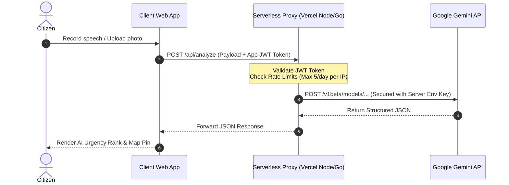

# 🏛️ Jan Priority Bharat - AI-Powered Constituency Development Platform

**Jan Priority Bharat** is a serverless, single-page, multi-lingual constituency priorities dashboard designed for **Track 1: People's Priorities**. It bridges the gap between citizens and their local Members of Parliament (MPs) by allowing citizens to voice their grievances via speech or text in regional languages and providing MPs with an AI-prioritized, map-based emergency dispatch and decision dashboard.

Designed with **zero backend server costs**, the platform runs entirely client-side, making it highly secure, deployable in seconds, and completely free to operate.

> [!IMPORTANT]
> **Gemini API Key Required**
> The application requires a free Gemini API Key from Google AI Studio. Click on the **Gear Settings Icon** at the top right of the application UI to enter your key before submitting grievances.

---

## 🏆 Step-by-Step Judging & Demonstration Guide

To evaluate the full depth of features implemented in this prototype, please follow this step-by-step walkthrough:

### ⚙️ Step 1: Set Your Gemini API Key
1. Click the **Gear Settings Icon** ⚙️ at the top right of the screen.
2. Paste your free **Gemini API Key** (obtainable instantly from [Google AI Studio](https://aistudio.google.com/)).
3. Select **Gemini 3.1 Flash (Recommended)** from the dropdown.
4. Click **Save Settings**. (Stored securely in your local browser storage).

---

### 📝 Step 2: Test the Citizen Intake Portal
Submit the following three test scenarios to observe the geocoding, spam filter, and emergency bypass mechanics:

#### 🟢 Scenario A: Standard Grievance (Narasaraopet)
* **Name**: `Ramesh Kumar`
* **Contact Number**: `98765 43210`
* **Landmark/Address**: `Narasaraopet, Palnadu` *(Do not click geocode. Let the background sync geocode it!)*
* **Attach Photo**: Select any local image (observe it automatically downsamples to `<40KB` to protect storage limits).
* **Description**: Type (or click the microphone and speak): *"The main road near the government high school is completely broken with large potholes causing regular traffic jams."*
* **Submission Result**: AI will categorize this as `roads`, assign a moderate-to-high urgency (`6-7/10`), geocode Narasaraopet coordinates, and route it to the Palnadu database.

#### 🚨 Scenario B: Critical Emergency & Safety Override (Delhi)
* **Name**: `Sarah Jones`
* **Contact Number**: `90123 45678`
* **Landmark/Address**: `Delhi Railway Station`
* **Description**: *"Massive protest and human barricade blocking the main railway station entry gate. Riot police arriving. Heavy traffic blockade."*
* **Submission Result**: The system's **programmatic safety override** will flag key phrases (*protest, blockade*), force `is_grievance` to true, and elevate urgency to `8+/10`. A popup alert will instantly show the **escalation dispatch notifications (SMS & Email)** sent to both the Delhi MP office and the Public Works Department.

#### 🔴 Scenario C: Conversational Spam Filter
* **Description**: *"Hi, I am bored and I want to order a cheese pizza."*
* **Submission Result**: The AI spam filter will flag this as a non-grievance. A notification will inform you that the submission has been filtered out to protect the MP's prioritized queue.

---

### 🏛️ Step 3: Test the MP Dashboard
1. Click on **MP Dashboard** in the top navigation bar.
2. You will be prompted with the **Authentication Gate** (session is cleared on load).
3. **Login as the Delhi MP**:
   * **MP Login ID**: `MP_DELHI`
   * **Password**: `admin`
   * **Action**: Click Submit. The map will automatically fly and zoom to New Delhi. You will see the critical protest marker plotted as a **red pulsing pin**.
4. **Interact with the Complaint**:
   * Click the marker pin on the map or click the card in the sidebar queue.
   * Click the attached photo thumbnail inside the card/popup ➔ the **high-resolution Glassmorphic Attachment Viewer** modal will zoom open.
5. **Mark as Resolved**:
   * Click **Mark as Resolved** inside the map popup.
   * Enter the administrative action taken: *"Dispatched railway police and local municipal commissioner to clear station gate assembly."*
   * Click OK. The platform will dynamically calculate the **resolution duration** (stopwatch speed) and trigger a **simulated SMS notification** back to the citizen's contact number showing completion details.
6. **Logout**: Click the red **Log Out** button in the stats bar to secure the session.

---

## 🏛️ MP Credentials Directory

Switch to the **MP Dashboard** and use any of the following credentials (all passwords are `admin`):

| MP ID | Constituency Name | Regional Coordinates Center |
| :--- | :--- | :--- |
| **`MP_PALNADU`** | Palnadu / Narasaraopet (Andhra Pradesh) | `[16.2366, 80.0531]` |
| **`MP_DELHI`** | New Delhi | `[28.6139, 77.2090]` |
| **`MP_HOWRAH`** | Howrah (West Bengal) | `[22.5850, 88.3475]` |
| **`MP_GUNTUR`** | Guntur (Andhra Pradesh) | `[16.3067, 80.4365]` |
| **`MP_HYDERABAD`** | Hyderabad (Telangana) | `[17.3850, 78.4867]` |

---

## 💻 Running Locally

You do not need to install node packages or run compile scripts.
* **Option A (Double-Click)**: Simply double-click `index.html` to open it directly in Google Chrome/Edge via the `file://` protocol. The entire codebase is engineered to be 100% compatible with local file execution.
* **Option B (Local Web Server)**: Run a local server in the project folder to run on `localhost`:
  * Using Node.js: `npx http-server`
  * Using Python: `python -m http.server 8080`

---

## 🔮 Architectural Trade-offs & Production Roadmap

For the hackathon submission, this application is built using a **serverless client-side architecture** where the user inputs their own Gemini API key. Here is the rationale behind this design, and how the application scales to a production-grade citizen portal.

### ⚖️ The Hackathon Setup: Client-Side Keys
* **Zero Billing Liability for Developers**: Eliminates the risk of developers being billed for heavy API usage during demonstration and evaluation.
* **Leaked Key Prevention**: Client keys are stored locally in the browser's `localStorage` and sent directly to Google's endpoints. They are never exposed to intermediate servers.
* **Independent Quota Capacity**: Prevents the application from crashing due to a single central API key hit by rate-limit caps.

### 🚀 The Production Path: Backend Proxy Gateway
To launch this platform to millions of public citizens without requiring them to supply API keys, the system transitions to a secure backend gateway architecture:

#### Production Transition Implementation Plan:
1. **Serverless API Route**: Deploy a Node/Go serverless function (e.g. Vercel Serverless Function) that holds the developer's billing-enabled Gemini API Key securely as a server environment variable (`GEMINI_API_KEY`).
2. **App Security & JWT**: Add simple OTP phone authentication. The backend generates a JWT token to verify that incoming requests originate from authenticated citizens.
3. **Rate Limiting**: Enforce a rate-limiter (e.g. Redis-backed Upstash rate limiter) to restrict IP addresses to a maximum of 5 AI processing submissions per day, preventing API abuse and cost overflows.

---

## 🌟 Key Features

### 1. Citizen Intake Portal
* **Continuous Voice Transcription**: Native browser Web Speech API captures and appends voice descriptions in **11 major Indian languages** (English, Hindi, Telugu, Tamil, Kannada, Malayalam, Bengali, Marathi, Gujarati, Punjabi, Urdu).
* **Defensive Geocoding**: Automatically geocodes typed landmark text in the background, ensuring coordinates map correctly and route complaints to the closest constituency.
* **Canvas Image Compression**: Uploaded photo proofs (e.g. potholes, blockades) are down-scaled to a maximum of `600px` and encoded as optimized JPEGs (~40KB) to bypass the browser's strict `5MB` local storage limit.
* **AI Spam & Irrelevance Filters**: Simple conversational chatter or purely personal requests (like *"I want pizza"*) are filtered out automatically.

### 2. Emergency Escalation Overrides
* Programmatic keyword triggers bypass the AI spam filter for critical public safety issues (containing terms like *protest, blockade, strike, accident, jam, fire*), raising urgency to `8+/10` automatically.
* Submitting critical complaints triggers simulated SMS/Email notifications dispatched to both the **MP hotline** and the **relevant Municipal/Roads/Health Authority**.

### 3. MP Decision Dashboard
* **Constituency Isolation**: Segregates complaints so each logged-in MP only sees priority cards and markers specific to their registered constituency.
* **Pulsing Map Pins**: Leaflet.js interactive map displays circular pins color-coded by urgency (Red: Critical, Orange: High, Green: Moderate).
* **Clickable Image Viewer**: Thumbnail attachments in popups and cards zoom-open in a glassmorphic high-resolution overlay preview.
* **Resolution Stopwatch & SMS Alerts**: Calculates and displays resolution duration when marking a complaint resolved, prompting the MP for actions taken, and sending a simulated SMS completion notification back to the citizen.

---

## 🛠️ Technology Stack

* **Structure**: HTML5 Semantic markup.
* **Styling**: Glassmorphism CSS3 with custom variables and micro-animations.
* **Map Engine**: Leaflet.js mapped to CartoDB dark-matter responsive tile layers.
* **Audio Engine**: Web Speech API wrapper.
* **AI Engine API**: Google Generative AI (Gemini SDK) utilizing a cascading retry fallback pipeline (`gemini-3.1-flash` ➔ `gemini-2.5-flash` ➔ `gemini-1.5-flash`).
